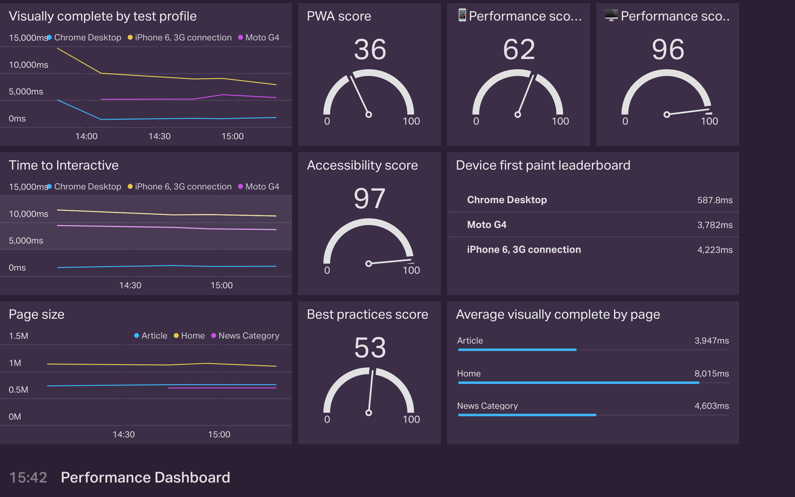

# Calibre Metrics on a Geckoboard Dashboard 📈

## [📚 Follow the step by step setup guide](#step-by-step-walk-through)
## [🏫 Watch the 1:30 video step by step setup guide](https://youtu.be/6GsDtYFeUdA)

### Tldr; setup guide

* Get your [Geckoboard API key](https://app.geckoboard.com/account)
* Deploy this app to Heroku 
* Visit the url of the heroku app you just deployed to find the webhook url (`<your-deployed-app>.herokuapp.com/webhook`)
* For each site that you want to report metrics from, create a new webhook (Calibre→Site→Settings→Integrations) and paste in the `webhook URL`

### Settings

* **GECKOBOARD_API_KEY** - The API key from your Geckoboard account
* **METRIC_WHITELIST** - `visually-complete,oncontentload` (Full list available below). Not setting this will result in *all* metrics being delivered to geckoboard.

---

### Metrics Calibre outputs

As of writing, Calibre outputs the following metrics. From time to time, new metrics will become available and this list will be updated.

* `console-warnings`
* `speed-index`
* `visually-complete`
* `firstrender`
* `lighthouse-best-practices-score`
* `lighthouse-accessibility-score`
* `lighthouse-performance-score`
* `lighthouse-pwa-score`
* `first-contentful-paint`
* `first-meaningful-paint`
* `dom-size`
* `estimated-input-latency`
* `first-interactive`
* `consistently-interactive`
* `json-size-in-bytes`
* `image-size-in-bytes`
* `font-size-in-bytes`
* `js-size-in-bytes`
* `css-size-in-bytes`
* `html-size-in-bytes`
* `page-wait-timing`
* `page-size-in-bytes`
* `asset-count`
* `onload`
* `oncontentload`

## Step by step walk through

All the links and reference that you need are available at the top of this README. 

Visit the [Geckoboard account details](https://app.geckoboard.com/account) page, copy your API Key. 

Click this deploy button: 

Name the application, something like `yourcompany-calibre-geckoboard`. 

Paste in your Geckoboard API Key.

**Optional step** - Add a comma separated list of metrics that you’d like sent to Geckoboard. (Leaving this blank means that Calibre will deliver ALL of the metrics that it records to Geckoboard)

Click Deploy. 

Once the app has been deployed, click the view button.

Copy the '/webhook' URL.

Go to your Calibre account.

For each site that you want to report metrics from, create a new webhook (Calibre → Site → Settings → Integrations) and paste in the `webhook URL`

Check "Snapshot", and save the notification.

At the end of every snapshot Calibre will send the collected metrics to this app using the webhook you just set up. This app will format those metrics for Geckoboard and send it using the Geckoboard API key.

Once a snapshot has been completed, visit your Geckoboard account and click 'Add widget'.

Choose 'datasets' as the source. You should now see Calibre metrics 👍

For timeseries charts, it can be valuable to 'split' metrics by 'Device profile'. In the screenshot example below, you’ll notice that we have two profiles "Chrome Desktop" and "iPhone 6, 3G connection".

You did it! Great work. 🏆

## Troubleshooting

If you’ve set everything up, run some snapshots and there appears to be no new Calibre datasets in your Geckoboard account, try running `heroku logs --tail --app YOUR_APP_NAME_HERE` to get a log from the deployed application.

If you think you’ve discovered a bug, issue or have ideas for how to improve calibre-geckoboard, please file an issue or raise a PR. (ps, We’ll send stickers and eternal 👏 for PRs)
